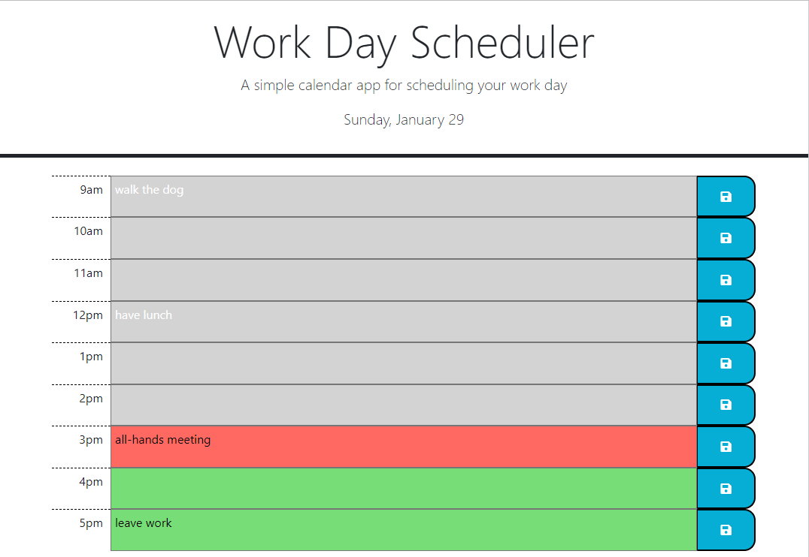
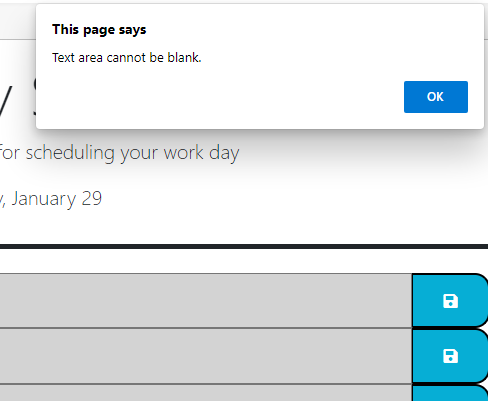
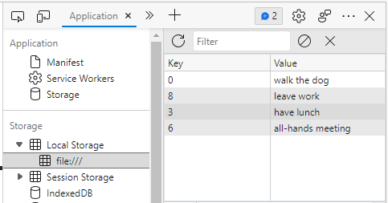

# challenge-5-work-day-scheduler
A simple calendar application that allows a user to save events for each hour of the day. 

## User Story
AS AN employee with a busy schedule  
I WANT to add important events to a daily planner  
SO THAT I can manage my time effectively

## Acceptance Criteria
GIVEN I am using a daily planner to create a schedule  
WHEN I open the planner  
THEN the current day is displayed at the top of the calendar  
WHEN I scroll down  
THEN I am presented with time blocks for standard business hours  
WHEN I view the time blocks for that day  
THEN each time block is color-coded to indicate whether it is in the past, present, or future  
WHEN I click into a time block  
THEN I can enter an event  
WHEN I click the save button for that time block  
THEN the text for that event is saved in local storage  
WHEN I refresh the page  
THEN the saved events persist

## Description of Work Performed
Wrote HTML, JavaScript, and CSS files based on provided mockup and sample code:
* Utilized Bootstrap and Google Fonts to apply certain styles to the page
* Used JQuery and Day.js to populate calendar time blocks
* Current day is displayed in the page header
* Calendar is displayed in rows that contain a time (from 9am-5pm), a text area to input events, and a save button
* Time blocks are color-coded depending on whether they are past, present, or future relative to the current time
* New events cannot be saved in time blocks that are in the past or if the text field is blank
* Events added to present or future time blocks are saved in local storage and persist if the page is reloaded

## Link to deployed GitHub page
[Deployed Challenge 5 Work Day Scheduler Repo](https://abmetheny.github.io/challenge-5-work-day-scheduler/)

## Screenshots

## License
This project is licensed under the MIT License - see the LICENSE.md file for details.